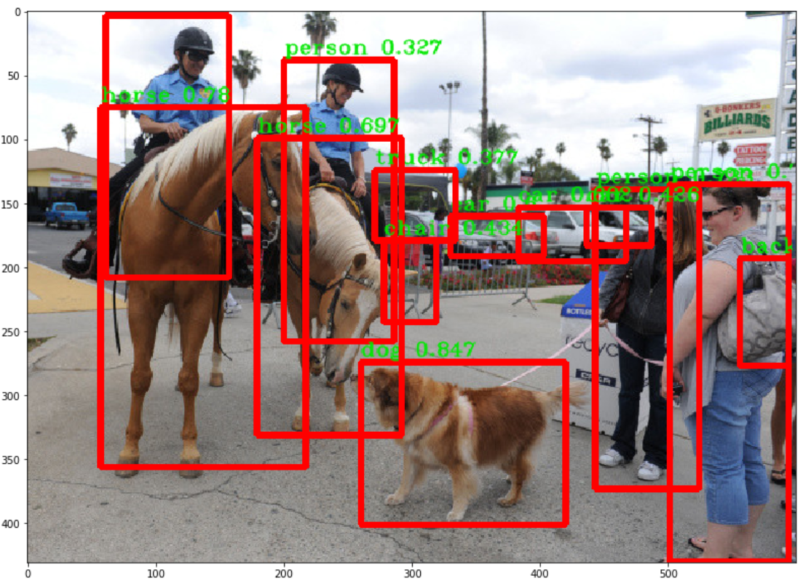

# Object Detection using YOLOv2 in [darkflow](https://github.com/thtrieu/darkflow)

### Introduction
This notebook is not about training on your own data. However, this notebook introduces how to use YOLOv2 on your data. It shows the process of taking input from your data (image), then outputing the pre-defined labels for the localized object on the image. After completing this notebook, I will go over how the training process can be done in the separate notebook.

### Contents
1. __References for YOLO implementation__
2. __Importing Dependences__
3. __Build the model__
4. __Gain the results of detected objects__
5. __Boxing around the objects__
6. __Boxing in Video and output the video__

